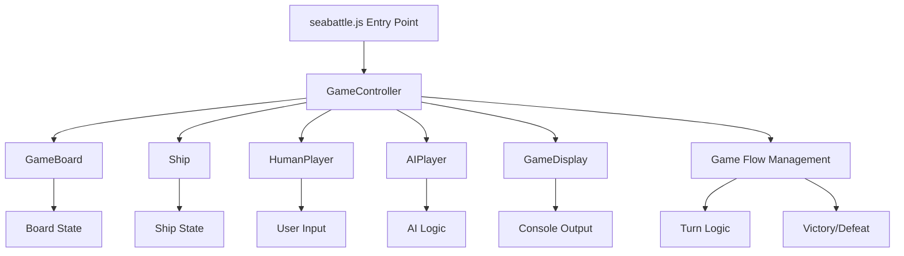

# Refactoring Summary: Sea Battle Game

## What Was Done

The original `seabattle.js` file was refactored to transform a monolithic, script-based implementation into a modern, modular, and maintainable codebase. The refactoring included:

-   **Separation of Concerns:** Core game logic, player logic, display, and game flow were split into dedicated modules/classes:
    -   `GameBoard` (board state, ship placement, attack processing)
    -   `Ship` (ship state, hit/destroyed logic)
    -   `Player`, `HumanPlayer`, `AIPlayer` (player state, input/AI logic)
    -   `GameDisplay` (console output)
    -   `GameController` (game orchestration, turn management)
-   **Modern JavaScript (ES6+) Practices:**
    -   Use of classes, async/await, and modular file structure.
    -   Clear separation between CLI entry point and game engine logic.
-   **Improved Maintainability:**
    -   Each class has a single responsibility and can be extended or modified independently.
    -   Game configuration is centralized and easily adjustable.
-   **Testability:**
    -   Core logic is decoupled from I/O, making it straightforward to write unit tests for all critical components.
    -   High test coverage was achieved for all core modules.
-   **Error Handling:**
    -   Robust error handling for invalid input, configuration, and game state.

## Achievements

-   **Code is now modular, readable, and maintainable.**
-   **All core logic is unit tested with high coverage.**
-   **Easier to extend (e.g., new player types, different board sizes, new rules).**
-   **Game can be run as a CLI or imported as a module.**

## High-Level Architecture

---

This refactoring makes the Sea Battle game robust, extensible, and ready for further development or integration.
